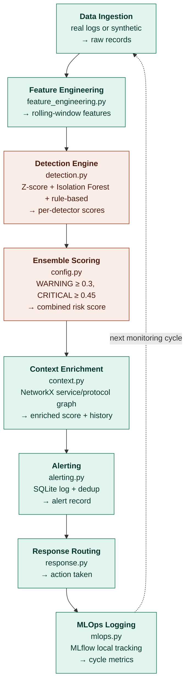
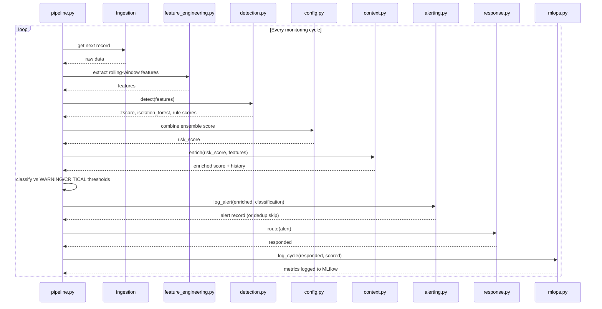

# AI-Based Network / Modem Anomaly Detection Pipeline

A 9-phase anomaly detection pipeline, built as a modular monolith (one module per
phase) per ADR-001. All 9 phases are implemented and wired into the orchestrator,
running end to end on real NSL-KDD data (with a synthetic fallback if the dataset
isn't present):

1. `src/ingestion.py` — loads real data or generates a synthetic fallback stream
2. `src/preprocessing.py` — basic cleaning/scaling
3. `src/context.py` — NetworkX graph, service/protocol context lookups
4. `src/feature_engineering.py` — rolling-window features
5. `src/detection.py` — Z-score + Isolation Forest + rule-based detectors
6. `src/scoring.py` — ensemble scoring (`config.py`: WARNING ≥ 0.3, CRITICAL ≥ 0.45)
7. `src/alerting.py` — SQLite alert log + dedup
8. `src/response.py` — response routing by severity
9. `src/mlops.py` — MLflow tracking per cycle

## Architecture

The pipeline runs as a modular monolith — each stage lives in its own file under `src/`, orchestrated by `pipeline.py`, and repeats every monitoring cycle.



### How the code executes each cycle


## Setup (all free, no Docker required)

```bash
python -m venv venv
source venv/bin/activate        # Windows: venv\\Scripts\\activate
pip install -r requirements.txt
```

## Dataset

This project uses **NSL-KDD**, a well-known free/public network-intrusion
dataset (a solid stand-in for "modem/network telemetry" — it's per-connection
records with duration, protocol, byte counts, error rates, etc., which is the
same shape of data a real ISP pipeline would ingest).

1. Download `KDDTrain+.txt` from the official mirror:
https://www.unb.ca/cic/datasets/nsl.html
(or any of the GitHub mirrors, e.g. `jmnwong/NSL-KDD-Dataset`)
2. Place it at `data/raw/KDDTrain+.txt`

**Don't have it downloaded yet?** That's fine — `src/ingestion.py` auto-generates
a small synthetic dataset with the same 41-column NSL-KDD schema if the real
file isn't found, so the whole pipeline runs today. Swap in the real file
whenever you have it; nothing else changes.

## Run it

```bash
python -m src.pipeline
```

You should see each of the 9 phases print what it received and passed on —
that's the skeleton working. Each `TODO` in `src/` is one build session.
## Scope: Diagram vs. What's Built

Every phase in the original 9-phase diagram exists in this codebase, and
the overall flow matches exactly. Within a few phases, the number of
techniques was scaled down to fit a 1-week, zero-budget, no-Docker build
(see the Architecture Decision Record in `docs/` for why).

| Phase | Diagram | Built | Match |
|---|---|---|---|
| 1. Data Ingestion | Real-time streams, device tagging | Real NSL-KDD data + synthetic fallback, batched | Full |
| 2. Data Preprocessing | Full cleaning/validation pipeline | Cleaning, dedup, scaling | Full |
| 3. Context Retrieval | MemGraph knowledge graph | NetworkX graph (service/protocol history) | Same concept, lighter tool |
| 4. Feature Engineering | Statistical, time-series, behavioural, cross-device | Rolling-window features + graph context | Partial |
| 5. Detection - Statistical | Z-score, IQR, Moving Average, EWMA | Z-score | 1 of 4 |
| 5. Detection - ML | Isolation Forest, Autoencoder, One-Class SVM, LSTM | Isolation Forest | 1 of 4 |
| 5. Detection - Behaviour | Rule engine, pattern matching, expert rules | 1 hand-written rule | Simplified |
| 5. Graph Context Validation | Score adjusted using graph relationships | Context attached but not yet used to adjust score | Gap |
| 6. Risk Scoring & Classification | Thresholds, Normal/Warning/Critical | Full, plus precision/recall vs. ground truth | Full+ |
| 7. Alert Management | Correlation, dedup, routing, escalation, dashboard | Dedup + SQLite log | Partial |
| 8. Response & Remediation | Automated + manual response paths | Simulated automated actions + manual routing | Present |
| 9. Continuous Learning & MLOps | Active/Reinforcement Learning, retraining, drift, registry, CI/CD | MLflow metric logging | 1 of 8 |
## Why these choices (see full ADR in the Documentation \& Architecture doc)

* **Modular monolith, not microservices** — one codebase, one laptop, no infra cost.
* **NetworkX before Memgraph** — zero setup; swap in Memgraph (Docker) later if needed.
* **SQLite before PostgreSQL** — zero setup; same upgrade path.
* **No message broker yet** — `ingestion.py` simulates a stream with a Python
generator; swap in MQTT/Kafka later without touching downstream code.


## Documentation

Full workflow documentation and the architecture decision record (tech stack, diagrams, roadmap) are in `docs/anomaly_detection_documentation_and_architecture.txt`.

The day-by-day GitHub development plan is in `docs/anomaly_detection_github_development_plan.txt`.
